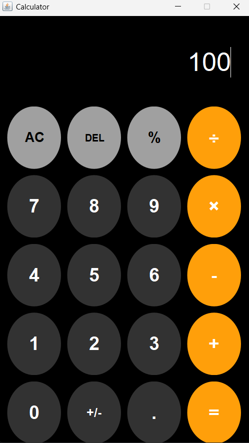

# 🧮 Calculator App

A modern desktop calculator application built using **Java Swing**.  
The project provides a clean graphical interface for performing basic arithmetic operations while demonstrating Java GUI development, event handling, and object-oriented programming concepts.

## 📸 Screenshot



## ✨ Features

- ➕ Addition
- ➖ Subtraction
- ✖️ Multiplication
- ➗ Division
- 🔢 Decimal number support
- 💯 Percentage calculation
- ➕/➖ Positive and negative number toggle
- ⌫ Delete the last entered digit
- 🧹 Clear all calculations using AC
- ⚠️ Division-by-zero error handling
- 🎨 Custom circular calculator buttons
- 🌙 Clean dark-themed graphical interface

## 🛠️ Technologies Used

- **Java**
- **Java Swing** — Graphical User Interface
- **Java AWT** — Layouts, colors, fonts, and event handling
- **Git** — Version control
- **GitHub** — Source code hosting

## 📁 Project Structure

```text
CalculatorApp/
├── src/
│   └── CalculatorApp.java
├── screenshots/
│   └── calculator.png
├── .gitignore
├── LICENSE
└── README.md
```

## 🚀 How to Run

### Prerequisites

Make sure the **Java Development Kit (JDK)** is installed on your computer.

Check your Java installation using:

```bash
java -version
javac -version
```

### 1. Clone the repository

```bash
git clone https://github.com/anmolbhojwani76-max/CalculatorApp.git
```

### 2. Open the project directory

```bash
cd CalculatorApp
```

### 3. Compile the application

```bash
javac src/CalculatorApp.java
```

### 4. Run the application

```bash
java -cp src CalculatorApp
```

## 🎯 Future Improvements

Possible improvements for future versions include:

- Keyboard input support
- Calculation history
- Scientific calculator functions
- Additional themes
- Improved responsive window sizing

## 📚 What I Learned

Through this project, I practiced:

- Building desktop applications with Java Swing
- Handling button events using `ActionListener`
- Designing custom GUI components
- Implementing arithmetic operations and input validation
- Handling errors such as division by zero
- Organizing a Java project for GitHub
- Using Git for version control

## 👨‍💻 Author

**Anmol Bhojwani**

## 📄 License

This project is licensed under the **MIT License**. See the `LICENSE` file for details.